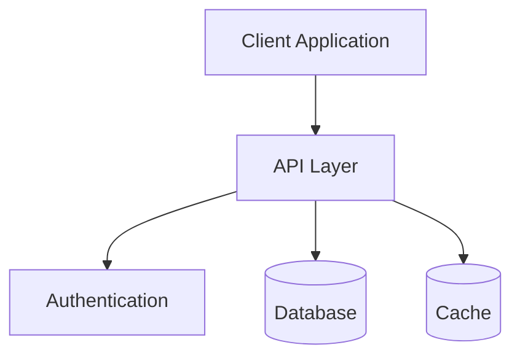
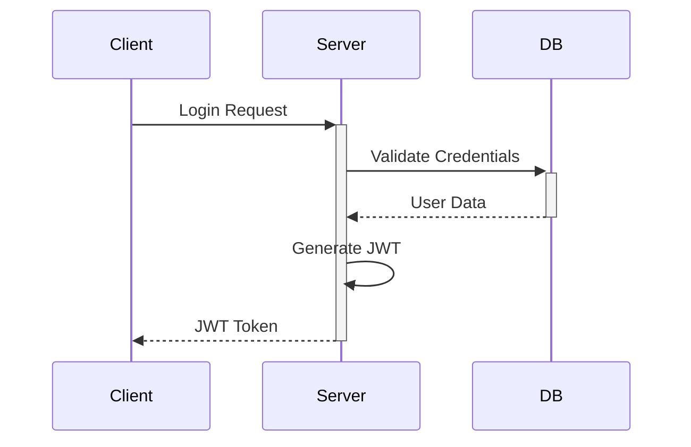
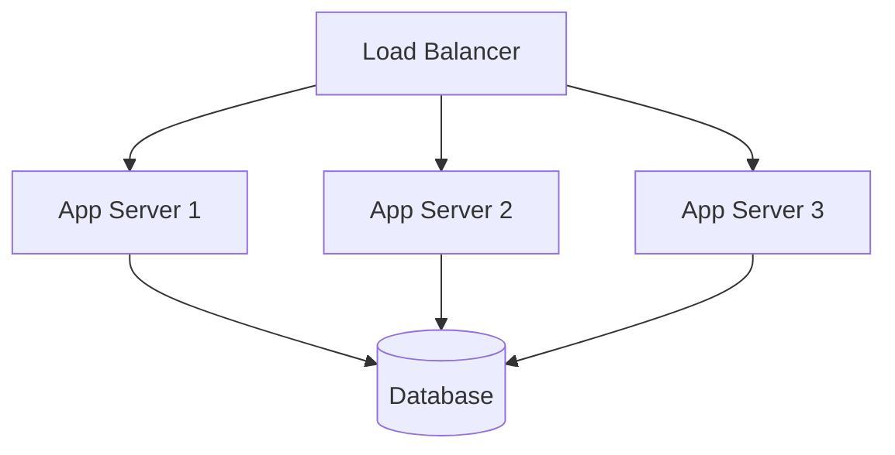

# Architecture Planning Guide

## 1. System Architecture

### High-Level Architecture


### Component Breakdown
- Frontend (React/Wasp)
- Backend (Node.js/Wasp)
- Database (PostgreSQL)
- Cache (Redis)
- Authentication Service

## 2. Data Architecture

### Data Models
```prisma
model User {
  id        Int      @id @default(autoincrement())
  email     String   @unique
  name      String
  posts     Post[]
  createdAt DateTime @default(now())
}

model Post {
  id        Int      @id @default(autoincrement())
  title     String
  content   String
  author    User     @relation(fields: [authorId], references: [id])
  authorId  Int
  createdAt DateTime @default(now())
}
```

### Database Design
- Tables and relationships
- Indexing strategy
- Partitioning plan
- Backup strategy

## 3. API Architecture

### REST Endpoints
```markdown
/api/v1/
  ├── /auth
  │   ├── POST /login
  │   ├── POST /register
  │   └── POST /logout
  ├── /users
  │   ├── GET /
  │   ├── GET /:id
  │   ├── PUT /:id
  │   └── DELETE /:id
  └── /posts
      ├── GET /
      ├── POST /
      ├── GET /:id
      ├── PUT /:id
      └── DELETE /:id
```

### Authentication Flow


## 4. Security Architecture

### Security Layers
1. Network Security
   - HTTPS
   - Firewalls
   - Rate limiting

2. Application Security
   - Authentication
   - Authorization
   - Input validation

3. Data Security
   - Encryption
   - Backup
   - Audit logging

## 5. Scalability Plan

### Horizontal Scaling


### Vertical Scaling
- CPU optimization
- Memory management
- Database tuning
- Caching strategy

## 6. Monitoring Architecture

### Metrics Collection
- Application metrics
- System metrics
- Business metrics
- Error tracking

### Logging Strategy
- Application logs
- Access logs
- Error logs
- Audit logs

## 7. Architecture Checklist

### System Design
- [ ] High-level architecture defined
- [ ] Component interactions documented
- [ ] Technology stack chosen
- [ ] Integration points identified

### Data Layer
- [ ] Data models designed
- [ ] Database schema planned
- [ ] Indexing strategy defined
- [ ] Backup plan created

### API Design
- [ ] API endpoints defined
- [ ] Authentication flow designed
- [ ] Error handling planned
- [ ] Rate limiting strategy

### Security
- [ ] Security layers defined
- [ ] Authentication method chosen
- [ ] Authorization rules set
- [ ] Data protection planned

### Scalability
- [ ] Scaling strategy defined
- [ ] Resource requirements estimated
- [ ] Performance targets set
- [ ] Bottlenecks identified

### Monitoring
- [ ] Monitoring tools selected
- [ ] Metrics defined
- [ ] Logging strategy planned
- [ ] Alert thresholds set

## 8. Next Steps

1. Review architecture with team
2. Create detailed technical specifications
3. Set up development environment
4. Begin implementation
5. Plan testing strategy
