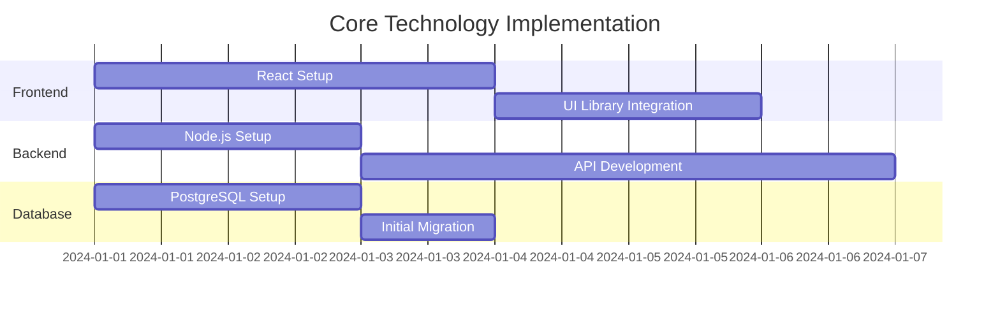

# Technology Stack Selection Guide

## 1. Core Technologies

### Frontend
- **Framework**: React (via Wasp)
  - UI Libraries: 
    - TailwindCSS
    - Material-UI
    - Chakra UI
  - State Management:
    - React Query (built into Wasp)
    - Context API
    - Redux (if needed)

### Backend
- **Framework**: Node.js (via Wasp)
  - API: REST/GraphQL (built into Wasp)
  - Authentication: JWT/OAuth
  - Validation: Zod/Joi

### Database
- **Primary**: PostgreSQL
  - ORM: Prisma (built into Wasp)
  - Migrations: Prisma Migrate
  - Backups: pg_dump/WAL

### Caching
- **System**: Redis
  - Session Storage
  - API Caching
  - Rate Limiting

## 2. Development Tools

### Version Control
- Git
- GitHub/GitLab
- Conventional Commits

### IDE/Editor
- VS Code
  - Extensions:
    - Wasp
    - Prisma
    - ESLint
    - Prettier

### Testing
- Jest
- React Testing Library
- Cypress
- k6 (performance)

### CI/CD
- GitHub Actions
- Docker
- Docker Compose

## 3. Technology Evaluation Criteria

### Frontend Framework
- [x] Component reusability
- [x] State management
- [x] Performance
- [x] Developer experience
- [x] Community support

### Backend Framework
- [x] API capabilities
- [x] Authentication
- [x] Database integration
- [x] Security features
- [x] Scalability

### Database
- [x] Data integrity
- [x] Query performance
- [x] Scalability
- [x] Backup solutions
- [x] Community support

## 4. Technology Decision Matrix

### Scoring System
- 1: Poor
- 2: Fair
- 3: Good
- 4: Excellent
- 5: Outstanding

### Frontend Frameworks
| Criteria          | React | Vue | Angular |
|-------------------|-------|-----|---------|
| Learning Curve    | 4     | 4   | 3       |
| Performance      | 4     | 4   | 4       |
| Ecosystem        | 5     | 4   | 4       |
| Documentation    | 5     | 5   | 4       |
| Community        | 5     | 4   | 4       |
| **Total**        | 23    | 21  | 19      |

### Backend Solutions
| Criteria          | Node.js | Python | Java |
|-------------------|---------|--------|------|
| Performance      | 4       | 4      | 5    |
| Ecosystem        | 5       | 5      | 4    |
| Learning Curve    | 4       | 4      | 3    |
| Scalability      | 4       | 4      | 5    |
| Development Speed | 5       | 4      | 3    |
| **Total**        | 22      | 21     | 20   |

## 5. Implementation Plan

### Phase 1: Core Setup

### Phase 2: Additional Tools
1. Development Environment
   - IDE configuration
   - Git setup
   - Docker configuration

2. Testing Infrastructure
   - Unit testing setup
   - Integration testing
   - E2E testing setup

3. CI/CD Pipeline
   - GitHub Actions setup
   - Deployment configuration
   - Monitoring integration

## 6. Technology Checklist

### Development Setup
- [ ] Frontend framework installed
- [ ] Backend framework configured
- [ ] Database installed
- [ ] Cache system setup
- [ ] Development tools configured

### Testing Environment
- [ ] Unit testing framework setup
- [ ] Integration tests configured
- [ ] E2E testing tools installed
- [ ] Performance testing ready
- [ ] CI pipeline configured

### Production Setup
- [ ] Production build process
- [ ] Deployment scripts
- [ ] Monitoring tools
- [ ] Backup systems
- [ ] Security measures

## 7. Next Steps

1. Set up development environment
2. Install core dependencies
3. Configure development tools
4. Create initial project structure
5. Begin development phase
