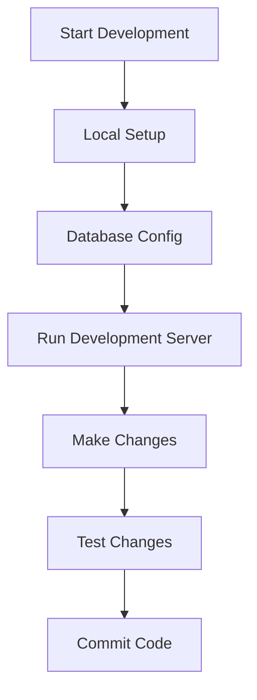

# Project Initialization Guide

## Overview
This guide organizes the existing Wasp project initialization steps into a clear, sequential workflow.

## Quick Reference
- [Environment Setup](2a.%20environment-setup.md)
- [Wasp Installation](2b.%20wasp-installation.md)
- [Troubleshooting Guide](../guides/troubleshooting-guide.md)

## Initialization Steps

### 1. Project Creation
Follow these steps from our existing documentation:
- Use the Wasp CLI commands
- Set up the project structure
- Configure initial dependencies

### 2. Version Control Setup
Reference our version control guide for:
- Git initialization
- Branching strategy
- Commit conventions

### 3. Docker Environment
Use our Docker development guide for:
- Container setup
- Development environment
- Database configuration

### 4. Database Setup
Follow our database configuration guide for:
- PostgreSQL setup
- Initial migrations
- Connection testing

## Common Workflows

### Development Workflow

### Testing Workflow
Reference our testing guide for:
- Unit tests setup
- Integration tests
- E2E testing configuration

## Next Steps
1. Review [Core Development](../3.%20Core%20Development/3a.%20basic-configuration.md)
2. Set up [Authentication](../3.%20Core%20Development/3c.%20authentication.md)
3. Begin [API Development](../3.%20Core%20Development/3d.%20api-development.md)

## Related Documentation
- [Security Guide](../5.%20Security/5a.%20security-basics.md)
- [Performance Guide](../6.%20Performance/6a.%20optimization-basics.md)
- [Deployment Guide](../7.%20Deployment/7a.%20deployment-preparation.md)
