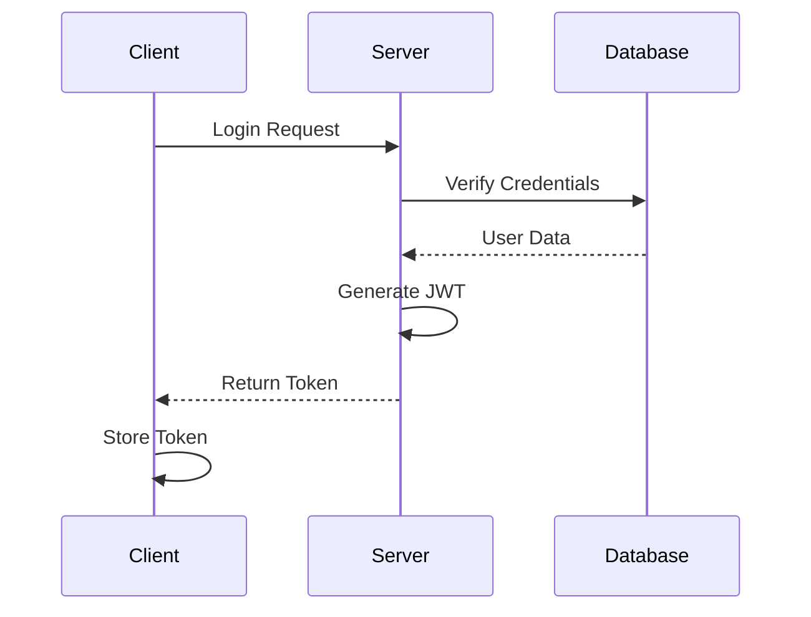
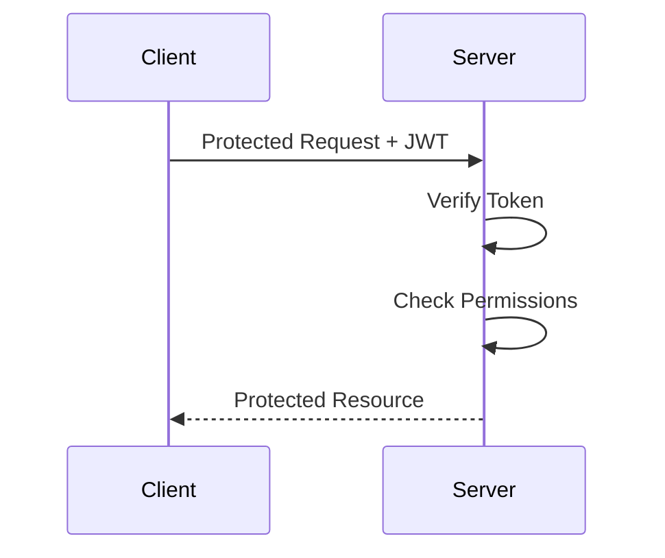

# Authentication Guide

## Overview
This guide organizes our existing authentication documentation into a structured workflow.

## Quick Reference
- [Security Guide](../5.%20Security/5a.%20security-basics.md)
- [API Development](3d.%20api-development.md)
- [Database Setup](3b.%20database-setup.md)

## Authentication Setup

### 1. Basic Configuration
From our existing auth setup:
```wasp
app MyApp {
  auth: {
    userEntity: User,
    methods: {
      usernameAndPassword: {}
    },
    onAuthFailedRedirectTo: "/login"
  }
}
```

### 2. User Entity
Reference our user model:
```wasp
entity User {=psl
  id          Int       @id @default(autoincrement())
  username    String    @unique
  password    String
  email       String    @unique
  role        String    @default("user")
  createdAt   DateTime  @default(now())
psl=}
```

### 3. Authentication Pages
From our existing page templates:
```wasp
route LoginRoute { path: "/login", to: LoginPage }
page LoginPage {
  component: import Login from "@client/pages/Login.jsx"
}

route SignupRoute { path: "/signup", to: SignupPage }
page SignupPage {
  component: import Signup from "@client/pages/Signup.jsx"
}
```

## Implementation Patterns

### 1. Login Form
Based on our form components:
```jsx
// src/client/pages/Login.jsx
import { useAuth } from '@wasp/auth'

export function Login() {
  const { login } = useAuth()
  
  const handleSubmit = async (e) => {
    e.preventDefault()
    try {
      await login(username, password)
    } catch (err) {
      setError(err.message)
    }
  }
  
  return (
    <form onSubmit={handleSubmit}>
      {/* Form fields */}
    </form>
  )
}
```

### 2. Protected Routes
From our route protection patterns:
```wasp
route DashboardRoute {
  path: "/dashboard",
  to: DashboardPage,
  authRequired: true
}

query getSecureData {
  fn: import { getSecureData } from "@server/queries.js",
  entities: [SecureData],
  auth: true
}
```

## Security Features

### 1. Password Handling
Reference our security guidelines:
```javascript
// src/server/auth/password.js
import bcrypt from 'bcrypt'

export const hashPassword = async (password) => {
  const salt = await bcrypt.genSalt(10)
  return bcrypt.hash(password, salt)
}

export const verifyPassword = async (password, hash) => {
  return bcrypt.compare(password, hash)
}
```

### 2. JWT Configuration
From our token management:
```javascript
// src/server/auth/jwt.js
import jwt from 'jsonwebtoken'

export const generateToken = (user) => {
  return jwt.sign(
    { id: user.id, role: user.role },
    process.env.JWT_SECRET,
    { expiresIn: '24h' }
  )
}
```

## Role-Based Access

### 1. Role Definition
Based on our RBAC documentation:
```wasp
entity User {=psl
  id          Int       @id @default(autoincrement())
  username    String    @unique
  role        String    @default("user")
psl=}
```

### 2. Role Checking
From our authorization patterns:
```javascript
// src/server/middleware/checkRole.js
export const checkRole = (role) => async (req, res, next) => {
  if (req.user?.role !== role) {
    return res.status(403).json({ message: 'Forbidden' })
  }
  next()
}
```

## Common Workflows

### Authentication Flow


### Authorization Flow


## Next Steps
1. Set up [API Security](../5.%20Security/5d.%20api-security.md)
2. Implement [User Management](3d.%20api-development.md)
3. Configure [Session Handling](../5.%20Security/5b.%20authentication-security.md)

## Related Documentation
- [Security Guide](../5.%20Security/5a.%20security-basics.md)
- [API Development](3d.%20api-development.md)
- [Testing Authentication](../4.%20Testing/4b.%20integration-testing.md)
