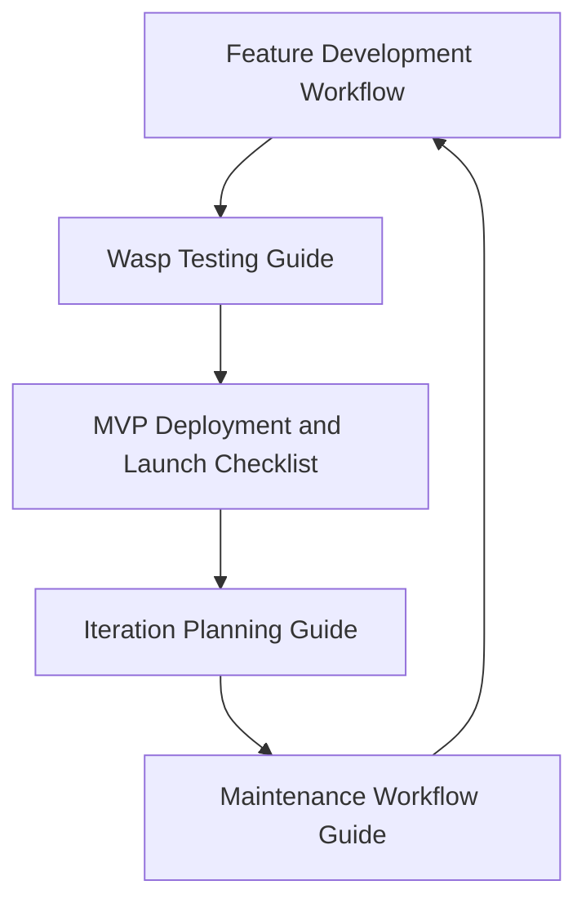

# Wasp Development Guides

## Comprehensive Guide Overview

### 1. Feature Development Workflow
- **File**: [feature-development-workflow.md](feature-development-workflow.md)
- **Focus**: Structured approach to implementing features
- **Key Topics**:
  * Requirements translation
  * Wasp entity creation
  * Action and query implementation
  * Frontend component development

### 2. Wasp Testing Guide
- **File**: [wasp-testing-guide.md](wasp-testing-guide.md)
- **Focus**: Comprehensive testing strategies
- **Key Topics**:
  * Unit testing
  * Integration testing
  * E2E testing
  * Performance testing
  * Security testing

### 3. MVP Deployment and Launch Checklist
- **File**: [mvp-deployment-launch-checklist.md](mvp-deployment-launch-checklist.md)
- **Focus**: Deployment preparation and launch validation
- **Key Topics**:
  * Infrastructure setup
  * Security hardening
  * Performance optimization
  * Monitoring configuration

### 4. Iteration Planning Guide
- **File**: [iteration-planning-guide.md](iteration-planning-guide.md)
- **Focus**: Continuous improvement and feature prioritization
- **Key Topics**:
  * Feedback collection
  * Feature prioritization
  * Development planning
  * Iteration tracking

### 5. Maintenance Workflow Guide
- **File**: [maintenance-workflow-guide.md](maintenance-workflow-guide.md)
- **Focus**: Long-term application health and optimization
- **Key Topics**:
  * System monitoring
  * Performance maintenance
  * Security updates
  * Technical debt management

## Guide Relationships

## How to Use These Guides

1. Start with the **Feature Development Workflow** when implementing new features
2. Use the **Wasp Testing Guide** to ensure code quality
3. Refer to the **MVP Deployment Checklist** for launch preparation
4. Follow the **Iteration Planning Guide** for continuous improvement
5. Maintain your application using the **Maintenance Workflow Guide**

## Best Practices

- Always refer to the latest version of each guide
- Adapt the guides to your specific project needs
- Continuously update and refine your workflow
- Encourage team collaboration and knowledge sharing

## Contributing

If you find any issues or have suggestions for improvement, please:
- Open an issue in the repository
- Submit a pull request with your proposed changes
- Discuss improvements with the team

## Resources

- [Wasp Official Documentation](https://wasp-lang.dev/docs)
- [Project Repository](https://github.com/your-org/your-project)
- [Community Support](https://wasp-lang.dev/community)
