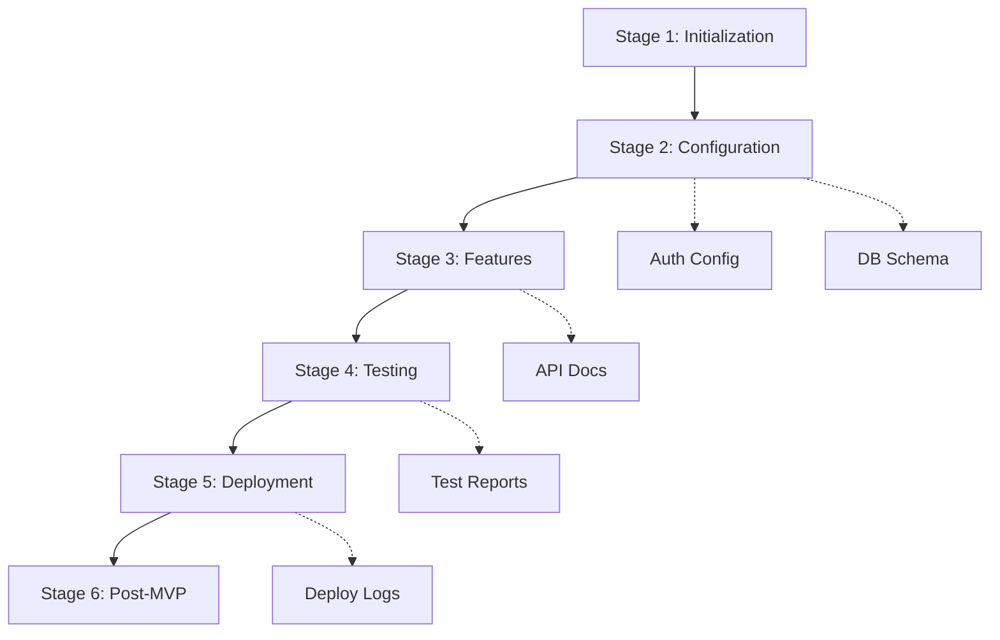

# Wasp Project Development Master Workflow

## Stage 1: Project Initialization
📂 [initialization/wasp-project-initialization-guide.md]
- Project setup
- Environment configuration
- Initial dependencies

**Output**: 
- Initialized project structure
- Basic .wasp configuration
- Environment setup

## Stage 2: Core Configuration
📂 [templates/wasp-config-templates.md]
- Entity definitions
- Authentication setup
- Route configuration

**Output**:
- Complete .wasp file
- Database schema
- Auth configuration

## Stage 3: Feature Development
📂 [templates/copy-paste-blocks.md]
- Component implementation
- API endpoints
- Business logic

**Output**:
- Working features
- API documentation
- Component library

## Stage 4: Testing & QA
📂 [workflows/mvp/mvp-testing-workflow.md]
- Unit tests
- Integration tests
- Performance testing

**Output**:
- Test coverage
- Performance metrics
- Bug reports

## Stage 5: MVP Deployment
📂 [workflows/mvp/mvp-deployment-guide.md]
- Production setup
- Deployment configuration
- Monitoring setup

**Output**:
- Deployed application
- Monitoring dashboard
- Production logs

## Stage 6: Post-MVP
📂 [workflows/post-mvp/*]
- Maintenance procedures
- Scaling strategies
- Iteration planning

**Output**:
- Maintenance documentation
- Scaling plan
- Future roadmap

## Dependencies Map

## Checkpoints & Validations

### Stage 1 ➡️ Stage 2
- [ ] Project structure verified
- [ ] Dependencies installed
- [ ] Environment variables set

### Stage 2 ➡️ Stage 3
- [ ] Database migrations successful
- [ ] Auth system working
- [ ] Routes accessible

### Stage 3 ➡️ Stage 4
- [ ] Features implemented
- [ ] API endpoints working
- [ ] UI components complete

### Stage 4 ➡️ Stage 5
- [ ] Tests passing
- [ ] Performance acceptable
- [ ] Security verified

### Stage 5 ➡️ Stage 6
- [ ] Production deployment successful
- [ ] Monitoring active
- [ ] Backups configured

## Documentation Requirements

Each stage must produce:
1. Technical documentation
2. User documentation
3. Progress report
4. Issue log
5. Next steps

## Quality Gates

### Code Quality
- Linting passed
- Type safety verified
- Best practices followed

### Documentation Quality
- Up-to-date
- Clear instructions
- Examples included

### Testing Quality
- Coverage > 80%
- E2E tests passing
- Performance benchmarks met

## Transition Guidelines

### Moving Between Stages
1. Complete all checkpoints
2. Update documentation
3. Get team review
4. Create transition report

### Handling Blockers
1. Document blocker
2. Assess impact
3. Create mitigation plan
4. Update timeline

## Templates & Resources

### Documentation Templates
- README.md
- API docs
- Component docs
- Test reports

### Code Templates
- Entity definitions
- API endpoints
- React components
- Test suites

### Review Checklists
- Code review
- Documentation review
- Security review
- Performance review
